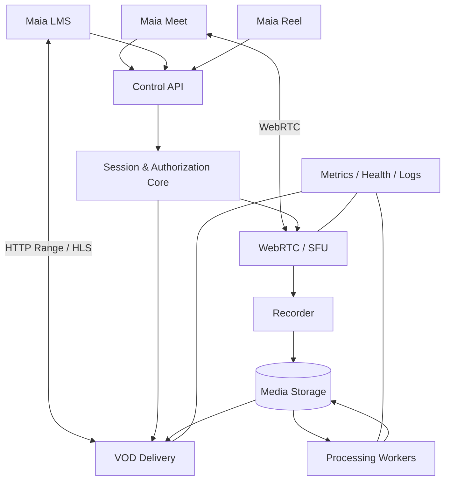

# Maia Streaming

**Native media infrastructure for the Maia Platform**

Maia Streaming is a C++20 media server designed to provide a common media plane for Maia Platform applications. It combines the proven real-time WebRTC/SFU concepts developed for Maia Meet with video-on-demand, audio-on-demand, HTTP byte-range delivery, adaptive streaming, recording, media processing, access control, and observability.

The project is intentionally application-neutral. Maia Meet uses the real-time path; Maia LMS uses the on-demand path; other Maia applications can use the same media infrastructure without embedding media transport logic.

## Goals

- Preserve the stable Maia Meet WebRTC/SFU implementation rather than rewrite it.
- Serve video and audio efficiently using HTTP `Range` / `206 Partial Content`.
- Add HLS adaptive streaming without coupling HLS to WebRTC.
- Support recording and offline processing through FFmpeg/libav without transcoding in the SFU hot path.
- Keep the control plane separate from the media plane.
- Provide token-based authorization hooks for Maia LMS and other applications.
- Provide production metrics, health checks, structured logs, and bounded resource usage.
- Target Ubuntu 24.04 LTS first.
- Remain small, auditable, self-hostable, and suitable for Maia Edge.

## Non-goals

- Replacing the Maia Meet user interface or signaling application.
- Decoding/transcoding every WebRTC packet.
- Building an MCU in the initial releases.
- Reimplementing cryptographic primitives.
- Replacing a CDN for Internet-scale global distribution.

## Architecture



## Repository layout

```text
maia-streaming/
├── CMakeLists.txt
├── LICENSE
├── README.md
├── ROADMAP.md
├── config/
│   └── maia-streaming.example.toml
├── deploy/
│   └── systemd/
├── docs/
│   ├── ARCHITECTURE.md
│   ├── API.md
│   ├── MEDIA_PIPELINES.md
│   ├── MAIA_MEET_MIGRATION.md
│   ├── SECURITY.md
│   ├── TESTING.md
│   └── DEPLOYMENT.md
├── include/maia/
│   ├── core/
│   ├── http/
│   ├── vod/
│   ├── hls/
│   ├── media/
│   ├── storage/
│   ├── auth/
│   ├── metrics/
│   └── webrtc/
├── src/
├── tests/
├── tools/
└── examples/player/
```

## Component boundaries

### `core`
Event loop integration, lifecycle, configuration, bounded worker queues, identifiers, clocks, error model and service orchestration.

### `webrtc`
Reusable WebRTC transport and SFU code originating from Maia Meet. ICE, DTLS, SRTP/SRTCP, RTP/RTCP, packet cache, routing and retransmission stay here. **Do not rewrite working Maia Meet media logic merely to fit this repository.**

### `http`
HTTP server primitives required by media delivery and control endpoints. Initial production scope: HTTP/1.1 behind Nginx/TLS. HTTP/2 or HTTP/3 can be evaluated later.

### `vod`
Video/audio asset delivery, byte ranges, seeking, ETag/conditional requests, MIME metadata and efficient file transfer.

### `hls`
Manifest and segment delivery. Packaging/transcoding is an offline/background responsibility, not a request-time operation.

### `media`
Asset metadata, tracks, renditions, codecs, recordings and processing job definitions.

### `storage`
Storage abstraction. v0.x starts with local filesystem storage; S3-compatible/object storage is a later adapter.

### `auth`
Short-lived signed playback tokens and application authorization hooks. Maia LMS owns course/enrollment policy; Maia Streaming only enforces a granted media capability.

### `metrics`
Prometheus-compatible metrics, health/readiness endpoints and structured operational events.

## Initial VOD request

```http
GET /v1/media/01J.../content HTTP/1.1
Host: media.maiaplatform.org
Authorization: Bearer <short-lived-token>
Range: bytes=1048576-
```

Response:

```http
HTTP/1.1 206 Partial Content
Accept-Ranges: bytes
Content-Range: bytes 1048576-7340031/7340032
Content-Length: 6291456
Content-Type: video/mp4
ETag: "..."
```

The browser can therefore use a normal HTML5 player while Maia Streaming controls authorization and media delivery.

## Recommended integration with Maia Meet

Do **not** add the complete `maia-meet` repository as a permanent Git submodule. Maia Meet contains a browser application and Node.js control plane that Maia Streaming does not need.

Use this migration sequence instead:

1. Freeze and benchmark the currently proven Maia Meet SFU revision.
2. Identify the exact `sfu/` source and dependency boundary.
3. Import/extract that code with history where practical.
4. Build it first as `maia_webrtc` / `maia_sfu` libraries without behavior changes.
5. Make Maia Meet consume the reusable library/service.
6. Run the same multi-participant audio+video regression and benchmark suite.
7. Only after parity, remove duplicated SFU code from Maia Meet.

A temporary development submodule is acceptable for side-by-side compatibility tests, but it should not become the architectural dependency direction.

## Build

```bash
cmake -S . -B build -DCMAKE_BUILD_TYPE=Release
cmake --build build -j
ctest --test-dir build --output-on-failure
```

## Release strategy

- **v0.1** — VOD audio/video, Range requests, filesystem storage, tokens, metrics.
- **v0.2** — Maia Meet SFU extraction/integration with behavioral parity.
- **v0.3** — HLS VOD and background packaging.
- **v0.4** — server-side recording and automatic publish pipeline.
- **v0.5** — adaptive profiles, object storage, horizontal media-node control.
- **v1.0** — stable APIs, production hardening and Maia Platform integration.

See [ROADMAP.md](ROADMAP.md) for details.

## License

Apache License 2.0. See [LICENSE](LICENSE).
