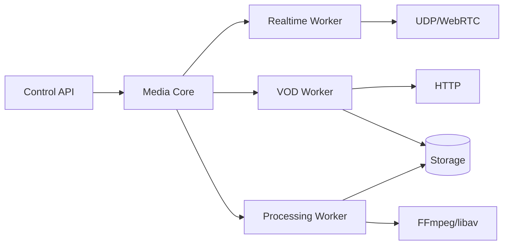

# Maia Streaming Architecture

## 1. Architectural rule

Maia Streaming is a **media plane**, not an LMS, conferencing UI, or course-management service. Application policy belongs to Maia Meet, Maia LMS and other Maia services. Maia Streaming receives narrowly scoped capabilities and performs media work.

The system has four independent data paths:

1. **Real-time:** WebRTC/SFU.
2. **On-demand:** HTTP byte-range video/audio delivery.
3. **Adaptive VOD:** HLS manifest/segment delivery.
4. **Processing:** asynchronous recording, normalization, packaging and thumbnail/audio extraction.

Failure or load in one path must not unnecessarily block another.

## 2. Processes

The first deployment may use one executable with isolated modules. The architecture must permit later process separation:



## 3. Real-time path

The real-time implementation is derived from the proven Maia Meet SFU. Its invariants are preserved:

- native C++20 service;
- standard browser WebRTC endpoint;
- ICE/STUN connectivity;
- DTLS handshake;
- SRTP/SRTCP;
- RTP/RTCP parsing and routing;
- packet cache/retransmission;
- Opus audio and VP8 video baseline;
- encoded payloads remain encoded in the normal forwarding path;
- bounded memory;
- event-driven network I/O rather than one thread per participant.

The extraction must not mix VOD/HLS logic into RTP routing.

## 4. VOD path

The VOD path maps an authorized immutable `AssetId` to one or more renditions. Requests are served with RFC-compatible byte ranges. Required behaviors include:

- GET and HEAD;
- single byte ranges initially;
- `206 Partial Content`;
- `416 Range Not Satisfiable`;
- `Accept-Ranges: bytes`;
- `Content-Range`;
- stable `Content-Length`;
- ETag and conditional validation;
- correct content type;
- cancellation when the client disconnects;
- backpressure and per-connection limits;
- efficient kernel-assisted transfer where compatible with TLS topology.

TLS should initially terminate at Nginx. This permits the C++ service to use efficient local transfer while Nginx handles public HTTPS and operational concerns.

## 5. HLS path

HLS is a packaging and delivery mechanism, not a reason to transcode per request. Background workers create renditions and manifests. The delivery server treats playlists and segments as immutable media objects subject to authorization and caching policy.

Recommended first profiles are deployment-dependent; do not hard-code resolution/bitrate assumptions into the core model.

## 6. Processing path

Processing jobs are explicit state machines:

`QUEUED -> CLAIMED -> RUNNING -> SUCCEEDED | FAILED | CANCELLED`

Examples:

- normalize uploaded video;
- generate MP4 with fast-start metadata;
- extract audio;
- generate thumbnails/poster frames;
- package HLS;
- transcode renditions;
- finalize a Maia Meet recording.

FFmpeg may initially run as a child process. Direct libav integration is optional and should only be adopted where it provides measurable operational benefit.

## 7. Storage model

An `Asset` is logical media. A `Rendition` is a concrete representation.

```text
Asset
  id
  owner/application namespace
  media type
  duration
  state
  metadata
  Renditions[]

Rendition
  id
  asset id
  container
  codec set
  width/height (video)
  bitrate
  byte size
  storage key
  checksum
```

Storage paths are never accepted directly from public requests. Public APIs use opaque identifiers and storage resolves them internally.

## 8. Authorization boundary

Maia LMS decides whether a user may watch lesson X. Maia Streaming should not query course enrollment on every range request. Instead LMS issues or obtains a short-lived capability containing claims such as:

- asset ID;
- subject/session ID;
- expiration;
- permitted operation (`play`, `download`, `live-publish`, etc.);
- optional IP/session binding;
- nonce/key ID.

The media server validates the capability locally.

## 9. Concurrency and backpressure

- Event-driven sockets.
- No thread per viewer.
- Bounded queues.
- Bounded RTP caches.
- Bounded processing concurrency.
- Explicit maximum connections and bandwidth policy.
- Slow clients must not retain unbounded buffers.
- Disk reads and processing jobs must not block WebRTC network loops.

## 10. Deployment boundary

Recommended initial production topology:

```text
Internet
   |
 Nginx :443
   |-- /api/media/*  -> Maia Streaming control/VOD HTTP
   |-- /hls/*        -> Maia Streaming or protected static delivery
   |
 UDP public ports ------> Maia Streaming WebRTC/SFU

Maia LMS ---- private/authenticated control API ----> Maia Streaming
```

## 11. Scale-out

Do not begin with distributed state. First establish single-node correctness and metrics. Later, a media directory assigns rooms/assets to nodes. Live rooms retain node affinity; immutable VOD can be replicated or placed behind object storage/CDN.
